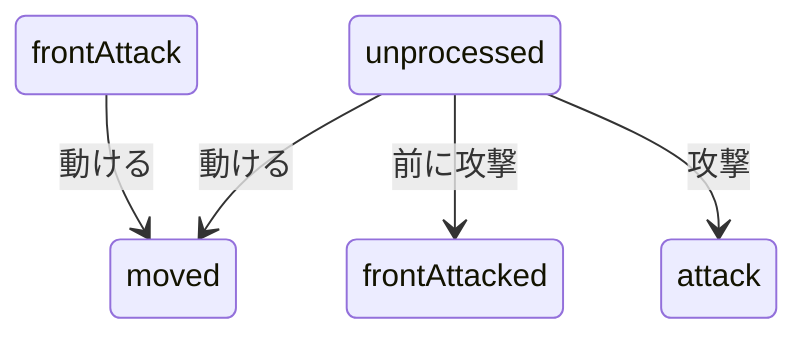

# logicalwars

## 遊ぶ
https://naosim.github.io/logicalwars/

## 開発環境
- deno

## ビルド
```
sh build.sh
```


## 設計メモ

```mermaid
stateDiagram-v2
    unprocessed --> moved:動ける
    unprocessed --> frontAttacked:前に攻撃
    unprocessed --> attack:攻撃
    frontAttack --> moved:動ける
```